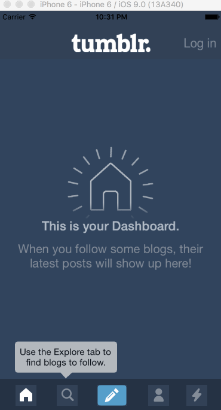

# Tumblr

This is an iOS app that runs through sample screens from the Tumblr UI

Time Spent - 12 hours spent in total

Completed User Stories:

* [x] Required: Tapping on Home, Search, Account, or Trending should show the respective screen and highlight the tab bar button.
* [x] Required: Compose button should modally present the compose screen.
* [ ] Optional: Compose screen is faded in while the buttons animate in. (Compose fades but buttons don't animate)
* [x] Optional: Login button should show animate the login form over the view controller.
* [x] Discover bubble should bob up and down unless the SearchViewController is tapped.

Walkthrough of all User Stories:

GIF created with [LiceCap](http://www.cockos.com/licecap/).
